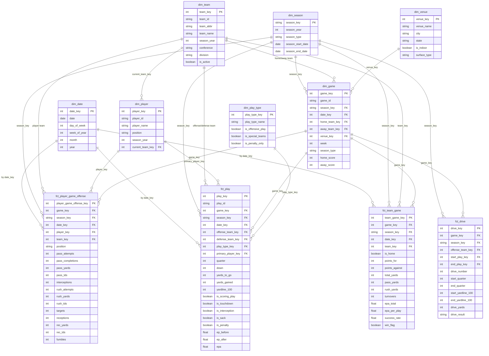

```mermaid
erDiagram
    dim_date {
        int      date_key PK
        date     date
        int      day_of_week
        int      week_of_year
        int      month
        int      year
    }

    dim_season {
        string   season_key PK
        int      season_year
        string   season_type  
        date     season_start_date
        date     season_end_date
    }

    dim_team {
        int      team_key PK
        string   team_id
        string   team_abbr
        string   team_name
        int      season_year
        string   conference
        string   division
        boolean  is_active
    }

    dim_player {
        int      player_key PK
        string   player_id
        string   player_name
        string   position
        int      season_year
        int      current_team_key FK
    }

    dim_venue {
        int      venue_key PK
        string   venue_name
        string   city
        string   state
        boolean  is_indoor
        string   surface_type
    }

    dim_game {
        int      game_key PK
        string   game_id
        string   season_key FK
        int      date_key FK
        int      home_team_key FK
        int      away_team_key FK
        int      venue_key FK
        int      week
        string   season_type
        int      home_score
        int      away_score
    }

    dim_play_type {
        int      play_type_key PK
        string   play_type_name
        boolean  is_offensive_play
        boolean  is_special_teams
        boolean  is_penalty_only
    }

    fct_play {
        int      play_key PK
        string   play_id
        int      game_key FK
        string   season_key FK
        int      date_key FK
        int      offense_team_key FK
        int      defense_team_key FK
        int      play_type_key FK
        int      primary_player_key FK
        int      quarter
        int      down
        int      yards_to_go
        int      yards_gained
        int      yardline_100
        boolean  is_scoring_play
        boolean  is_touchdown
        boolean  is_interception
        boolean  is_sack
        boolean  is_penalty
        float    ep_before
        float    ep_after
        float    epa
    }

    fct_drive {
        int      drive_key PK
        int      game_key FK
        string   season_key FK
        int      offense_team_key FK
        int      start_play_key FK
        int      end_play_key FK
        int      drive_number
        int      start_quarter
        int      end_quarter
        int      start_yardline_100
        int      end_yardline_100
        int      drive_yards
        string   drive_result
    }

    fct_team_game {
        int      team_game_key PK
        int      game_key FK
        string   season_key FK
        int      date_key FK
        int      team_key FK
        boolean  is_home
        int      points_for
        int      points_against
        int      total_yards
        int      pass_yards
        int      rush_yards
        int      turnovers
        float    epa_total
        float    epa_per_play
        float    success_rate
        boolean  win_flag
    }

    fct_player_game_offense {
        int      player_game_offense_key PK
        int      game_key FK
        string   season_key FK
        int      date_key FK
        int      player_key FK
        int      team_key FK
        string   position
        int      pass_attempts
        int      pass_completions
        int      pass_yards
        int      pass_tds
        int      interceptions
        int      rush_attempts
        int      rush_yards
        int      rush_tds
        int      targets
        int      receptions
        int      rec_yards
        int      rec_tds
        int      fumbles
    }

    %% Relationships (dims on left, facts on right where possible)
    dim_date   ||--o{ fct_play                : "by date_key"
    dim_date   ||--o{ fct_team_game           : "by date_key"
    dim_date   ||--o{ fct_player_game_offense : "by date_key"

    dim_season ||--o{ dim_game                : "season_key"
    dim_season ||--o{ fct_play                : "season_key"
    dim_season ||--o{ fct_team_game           : "season_key"
    dim_season ||--o{ fct_player_game_offense : "season_key"
    dim_season ||--o{ fct_drive               : "season_key"

    dim_team   ||--o{ dim_game                : "home/away team"
    dim_team   ||--o{ fct_play                : "offense/defense team"
    dim_team   ||--o{ fct_team_game           : "team_key"
    dim_team   ||--o{ fct_player_game_offense : "player team"
    dim_team   ||--o{ dim_player              : "current_team_key"

    dim_player ||--o{ fct_play                : "primary_player_key"
    dim_player ||--o{ fct_player_game_offense : "player_key"

    dim_game   ||--o{ fct_play                : "game_key"
    dim_game   ||--o{ fct_drive               : "game_key"
    dim_game   ||--o{ fct_team_game           : "game_key"
    dim_game   ||--o{ fct_player_game_offense : "game_key"

    dim_venue  ||--o{ dim_game                : "venue_key"

    dim_play_type ||--o{ fct_play             : "play_type_key"
```